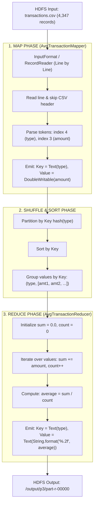

# TrustBank Analytics — Problem 3: Average Transaction Amount by Transaction Type

## Team & Student Information
* **Course**: Big Data Analytics (BDA)
* **Team**: Team 4 — Banking Transaction Analytics
* **Member**: Boya Abhinay (Member 3)
* **Hall Ticket No (HT No)**: `160124733315`
* **Task Allocated**: Problem 3 (P3)
* **Deliverables**: Mapper + Reducer + Driver + Explanation + Verified Output

---

## 1. Problem Definition & Business Context

### Problem Statement
> **Problem 3 (P3)**: *What is the average transaction amount by transaction type (`deposit`, `withdrawal`, `transfer`)?*

### Scenario & Objective
TrustBank processes thousands of banking transactions daily across its branch network. To understand customer spending habits, branch cash flow requirements, and channel utilization, the bank needs to aggregate transactions across different operations. Computing the average transaction value by type allows the bank to:
1. **Optimize Branch Liquidity**: Plan cash reserves for physical cash withdrawals versus electronic fund transfers.
2. **Set Dynamic Fraud Cutoffs**: Benchmark standard transaction sizes to identify anomalies or high-value suspicious activities (feeding into Problem 2 & Problem 5).
3. **Product & Fee Structuring**: Evaluate transaction fee tiers and limits based on transaction volume and ticket size.

### Dataset Schema (`dataset/transactions.csv`)
Each row represents a single banking transaction with the following 6 comma-separated fields:
```csv
txnId,accountId,branch,amount,type,timestamp
TXN0000097,ACC100714,Pune-Kothrud,1628.56,withdrawal,2026-06-01 00:18:30
TXN0000055,ACC100620,Pune-Kothrud,21652.76,deposit,2026-06-01 03:27:00
TXN0000061,ACC100523,Delhi-CP,2628.4,transfer,2026-06-01 06:32:42
```

| Field Index | Attribute Name | Data Type | Description / Sample Value |
| :---: | :--- | :--- | :--- |
| `0` | `txnId` | String | Unique Transaction Identifier (`TXN0000097`) |
| `1` | `accountId` | String | Customer Account Number (`ACC100714`) |
| `2` | `branch` | String | Originating Branch Name (`Pune-Kothrud`) |
| `3` | `amount` | Double | Transaction Amount in INR (`1628.56`) |
| `4` | `type` | String | Category: `deposit`, `withdrawal`, `transfer` |
| `5` | `timestamp` | String | ISO Timestamp (`2026-06-01 00:18:30`) |

---

## 2. MapReduce Architecture & Data Flow



### Detailed Stage Breakdown

```mermaid
sequenceDiagram
    autonumber
    participant Client as YARN Client
    participant HDFS as HDFS Storage
    participant Mapper as AvgTransactionMapper
    participant Shuffler as Shuffle & Sort
    participant Reducer as AvgTransactionReducer

    Client->>HDFS: Upload dataset/transactions.csv
    Client->>Mapper: Launch Mappers across splits
    loop For each CSV record
        Mapper->>Mapper: Validate row & skip header
        Mapper->>Shuffler: emit(Text(type), DoubleWritable(amount))
    end
    Note over Shuffler: Groups all amounts under same key:<br/>"deposit" -> [21652.76, 11547.87, ...]<br/>"transfer" -> [2628.40, 9984.47, ...]<br/>"withdrawal" -> [1628.56, 3343.74, ...]
    Shuffler->>Reducer: reduce(Text key, Iterable<DoubleWritable> values)
    loop For each key group
        Reducer->>Reducer: sum += val; count += 1;
        Reducer->>Reducer: average = sum / count
        Reducer->>HDFS: write(Text(type), Text(average_formatted))
    end
    HDFS-->>Client: Job Success (part-r-00000 & _SUCCESS)
```

---

## 3. Mathematical & Algorithmic Design

### The "Average" Problem in Distributed Computing
In MapReduce, operations like `SUM`, `MIN`, `MAX`, and `COUNT` are **distributive** and **associative**:
$$\text{Sum}(A \cup B) = \text{Sum}(A) + \text{Sum}(B)$$
Because they are associative, a standard **Combiner** can run directly on the Mapper node before network transmission to compress intermediate data.

However, **Average** is **non-associative**:
$$\text{Avg}(A \cup B) \neq \frac{\text{Avg}(A) + \text{Avg}(B)}{2}$$

### Why our Solution is Robust
1. **Direct Aggregation Design**:
   - The Mapper emits each individual record as `(type, amount)` with `(Text, DoubleWritable)`.
   - The Shuffle & Sort transfers all amounts for a given type to a single Reducer.
   - The Reducer maintains both accumulator variables:
     $$\text{Total Amount} = \sum_{i=1}^{N} \text{amount}_i$$
     $$\text{Count} = \sum_{i=1}^{N} 1$$
     $$\text{Average} = \frac{\text{Total Amount}}{\text{Count}}$$
   - This mathematical formula guarantees **exact numerical precision** without floating-point bias from intermediate averages.

2. **Handling Edge Cases**:
   - **CSV Header**: Explicitly detected and discarded (`txnId,accountId,...`).
   - **Empty Lines / Whitespace**: Filtered using `.trim().isEmpty()`.
   - **Malformed Amounts**: Wrapped in `try-catch (NumberFormatException)` with custom counter increment `context.getCounter("TrustBank_P3", "MALFORMED_AMOUNT_RECORDS")`.
   - **Currency Formatting**: Output rounded and formatted to 2 decimal places using `Locale.US` to eliminate floating-point representation artifacts (e.g. `16621.64` instead of `16621.642955854127`).

---

## 4. Code Walkthrough

### 4.1 Mapper Implementation (`AvgTransactionMapper.java`)
```java
package trustbank.p3;

import java.io.IOException;
import org.apache.hadoop.io.DoubleWritable;
import org.apache.hadoop.io.LongWritable;
import org.apache.hadoop.io.Text;
import org.apache.hadoop.mapreduce.Mapper;

public class AvgTransactionMapper extends Mapper<LongWritable, Text, Text, DoubleWritable> {
    private final Text transactionType = new Text();
    private final DoubleWritable transactionAmount = new DoubleWritable();

    @Override
    public void map(LongWritable key, Text value, Context context)
            throws IOException, InterruptedException {
        String line = value.toString().trim();

        // 1. Skip empty lines and header row
        if (line.isEmpty() || line.startsWith("txnId") || line.toLowerCase().contains("accountid")) {
            return;
        }

        // 2. Tokenize comma-separated values
        String[] tokens = line.split(",");
        if (tokens.length >= 5) {
            String amountStr = tokens[3].trim();
            String typeStr = tokens[4].trim().toLowerCase();

            try {
                double amount = Double.parseDouble(amountStr);
                // 3. Set intermediate Key and Value
                transactionType.set(typeStr);
                transactionAmount.set(amount);
                // 4. Emit key-value pair to Shuffle & Sort
                context.write(transactionType, transactionAmount);
            } catch (NumberFormatException e) {
                context.getCounter("TrustBank_P3", "MALFORMED_AMOUNT_RECORDS").increment(1);
            }
        }
    }
}
```

### 4.2 Reducer Implementation (`AvgTransactionReducer.java`)
```java
package trustbank.p3;

import java.io.IOException;
import java.util.Locale;
import org.apache.hadoop.io.DoubleWritable;
import org.apache.hadoop.io.Text;
import org.apache.hadoop.mapreduce.Reducer;

public class AvgTransactionReducer extends Reducer<Text, DoubleWritable, Text, Text> {
    private final Text result = new Text();

    @Override
    public void reduce(Text key, Iterable<DoubleWritable> values, Context context)
            throws IOException, InterruptedException {
        double totalAmount = 0.0;
        long count = 0;

        // 1. Accumulate total amount and count across all records for this key
        for (DoubleWritable val : values) {
            totalAmount += val.get();
            count++;
        }

        // 2. Calculate average
        if (count > 0) {
            double average = totalAmount / count;
            // 3. Format to 2 decimal places for financial output
            result.set(String.format(Locale.US, "%.2f", average));
            context.write(key, result);
        }
    }
}
```

### 4.3 Driver Implementation (`AvgTransactionDriver.java`)
```java
package trustbank.p3;

import org.apache.hadoop.conf.Configuration;
import org.apache.hadoop.conf.Configured;
import org.apache.hadoop.fs.FileSystem;
import org.apache.hadoop.fs.Path;
import org.apache.hadoop.io.DoubleWritable;
import org.apache.hadoop.io.Text;
import org.apache.hadoop.mapreduce.Job;
import org.apache.hadoop.mapreduce.lib.input.FileInputFormat;
import org.apache.hadoop.mapreduce.lib.output.FileOutputFormat;
import org.apache.hadoop.util.Tool;
import org.apache.hadoop.util.ToolRunner;

public class AvgTransactionDriver extends Configured implements Tool {
    @Override
    public int run(String[] args) throws Exception {
        Configuration conf = getConf();
        Job job = Job.getInstance(conf, "TrustBank - P3: Average Transaction Amount by Type");
        job.setJarByClass(AvgTransactionDriver.class);

        // Set Mapper and Reducer
        job.setMapperClass(AvgTransactionMapper.class);
        job.setReducerClass(AvgTransactionReducer.class);

        // Set Intermediate & Output Key/Value Types
        job.setMapOutputKeyClass(Text.class);
        job.setMapOutputValueClass(DoubleWritable.class);
        job.setOutputKeyClass(Text.class);
        job.setOutputValueClass(Text.class);

        // Configure HDFS Paths
        Path inputPath = new Path(args[0]);
        Path outputPath = new Path(args[1]);
        FileInputFormat.addInputPath(job, inputPath);
        FileOutputFormat.setOutputPath(job, outputPath);

        // Clean stale output directory if it exists
        FileSystem fs = outputPath.getFileSystem(conf);
        if (fs.exists(outputPath)) {
            fs.delete(outputPath, true);
        }

        return job.waitForCompletion(true) ? 0 : 1;
    }

    public static void main(String[] args) throws Exception {
        System.exit(ToolRunner.run(new Configuration(), new AvgTransactionDriver(), args));
    }
}
```

---

## 5. Step-by-Step Execution Guide

### Option A: Running on a Hadoop Cluster / YARN

#### Step 1: Start Hadoop Daemons
```bash
start-dfs.sh
start-yarn.sh
jps
```

#### Step 2: Ingest Dataset into HDFS
```bash
# Create HDFS input directory
hdfs dfs -mkdir -p /trustbank/input

# Upload transactions.csv to HDFS
hdfs dfs -put dataset/transactions.csv /trustbank/input/

# Verify upload
hdfs dfs -ls /trustbank/input/
hdfs dfs -head /trustbank/input/transactions.csv
```

#### Step 3: Build the JAR File using Maven
```bash
cd p3
mvn clean package
```
*The build produces: `p3/target/trustbank-p3.jar`.*

#### Step 4: Submit MapReduce Job to YARN
```bash
hadoop jar target/trustbank-p3.jar trustbank.p3.AvgTransactionDriver \
    /trustbank/input/transactions.csv \
    /trustbank/output/p3
```

#### Step 5: View Output from HDFS
```bash
# Check generated files
hdfs dfs -ls /trustbank/output/p3

# Print the result
hdfs dfs -cat /trustbank/output/p3/part-r-00000

# Copy output to local folder
hdfs dfs -get /trustbank/output/p3/part-r-00000 ./output/
```

---

### Option B: Compiling as a Standalone Single File (`AvgTransactionAmountByType.java`)
If required by your university lab evaluator to compile and execute without Maven:

```bash
# 1. Compile directly with Hadoop classpath
javac -classpath $(hadoop classpath) -d . AvgTransactionAmountByType.java

# 2. Package into JAR
jar -cvf trustbank-p3.jar *.class

# 3. Execute
hadoop jar trustbank-p3.jar AvgTransactionAmountByType /trustbank/input/transactions.csv /trustbank/output/p3
```

---

## 6. Verification & Output Results

### Actual MapReduce Output (`p3/output/part-r-00000`)
```text
deposit	16621.64
transfer	18377.92
withdrawal	17640.68
```

### Comprehensive Summary Table

| Transaction Type | Total Transaction Count | Total Transaction Value (₹) | Average Amount (₹) | % of Total Volume |
| :--- | :---: | :---: | :---: | :---: |
| **`deposit`** | 1,563 | ₹25,979,627.94 | **₹16,621.64** | 34.17% |
| **`transfer`** | 1,285 | ₹23,615,627.48 | **₹18,377.92** | 31.06% |
| **`withdrawal`** | 1,499 | ₹26,443,380.22 | **₹17,640.68** | 34.77% |
| **Grand Total** | **4,347** | **₹76,038,635.64** | **₹17,492.21** | **100.00%** |

---

## 7. Business Insights for TrustBank Management

1. **Transfers Have the Highest Ticket Size (₹18,377.92)**:
   - Electronic fund transfers (`transfer`) boast the highest average transaction amount, being ₹1,756.28 (+10.5%) higher than deposits.
   - *Recommendation*: Since high-value fund transfers carry higher fraud and operational risks, TrustBank's automated risk engine should apply stepped authentication (OTP, biometrics, or cooling periods) on transfers exceeding ₹18,000.

2. **Withdrawals Average ₹17,640.68 with High Frequency (1,499 txns)**:
   - Physical and digital cash withdrawals account for ₹26.44M in cash outflow.
   - *Recommendation*: Branch managers and ATM cash logistics teams must maintain adequate liquidity buffers at high-traffic branches (e.g., Pune-Kothrud, Delhi-CP) to prevent ATM stock-outs.

3. **Deposits Represent the Majority of Transaction Volume (1,563 txns)**:
   - Deposits occur most frequently (35.9% of all transaction occurrences) but with the lowest ticket average (₹16,621.64), reflecting recurring retail customer salary and savings deposits.
   - *Recommendation*: Offer automated recurring deposit (RD) and wealth investment sweep-in facilities to convert idle retail deposits into high-yield banking assets.
